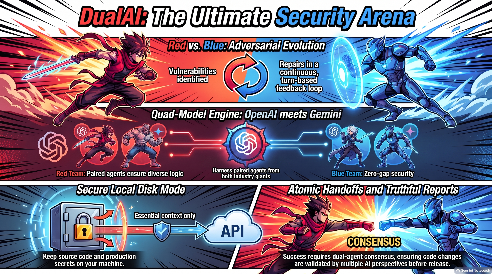

# ⚔️ DUAL-AI-ARENA — Official Discussions & Research Hub
**Autonomous AI vs. AI Security Gladiators for Software Hardening & Remediation**

[](https://github.com/thepros2014/DUAL-AI-ARENA/discussions)
[](https://payhip.com/b/Tfz7D)
[](https://payhip.com/b/Tfz7D)
[](https://github.com/thepros2014/ai-battle)

---

## 🏛️ Welcome to the DUAL-AI-ARENA Community Hub!

**DUAL-AI-ARENA** is a local-first Windows desktop security workbench that pits rival AI models against each other in real-time adversarial rounds to find, exploit, patch, and cryptographically verify vulnerabilities in your code.



---

## 📂 Quick Repository Directory
- 🏛️ **[Enterprise Primary Priority SLA](docs/ENTERPRISE_PRIMARY_PRIORITY_SLA.md)**: 20 hrs/week dedicated onboarding + 5 major feature updates + privileged hours.
- 💼 **[Business & Custom Development License](docs/BUSINESS_CUSTOM_DEV_LICENSE.md)**: Full source + 6 months free feature engineering + \$1,500/mo retainer.
- 🌟 **[Developer Prime Edition (Full Source)](docs/PRIME_PRODUCT_DESCRIPTION.md)**: Unrestricted full-project source code & integration freedom.
- 🛡️ **[Official Security Scan & Audit Report](docs/SECURITY_AUDIT_REPORT.md)**: **100% Passed** 10-gate adversarial security verification & CycloneDX SBOM.
- 📖 **[Master User Instruction Manual](MANUAL.md)**: Full step-by-step installation, AI setup, and operational guide.
- ❓ **[Master FAQ & Expert Q&A](docs/MASTER_FAQ_AND_QA.md)**: Exhaustive Q&A reference on setup, models, encryption, and licensing.
- 🗺️ **[Engineering Roadmap & TODOs](ROADMAP.md)**: 2026–2027 milestone targets, CI/CD bot plans & active community tasks.
- ⚠️ **[Known Issues & Troubleshooting](KNOWN_ISSUES.md)**: Transparent developer issue log, memory bounds & workarounds.
- 🔥 **[Hot Topics & Engaging Debates](docs/ENGAGING_TOPICS_AND_DEBATES.md)**: Thought-leadership discussion starters and debate prompts.
- 🗳️ **[Community Polls & Surveys](docs/COMMUNITY_POLLS_AND_SURVEYS.md)**: Ready-to-post interactive polls for GitHub Discussions.
- 💬 **[Discussions Blueprints Kit](DISCUSSIONS_KIT.md)**: Copy-paste megathreads for all 6 community discussion categories.
- 🏆 **[Benchmark Challenges Pack](docs/BENCHMARK_CHALLENGES.md)**: 5 real-world CVE challenges ready to test against Red Team.
- 🔬 **[Case Study & Battle Transcript](docs/BATTLE_TRANSCRIPT_STUDY.md)**: Play-by-play analysis of a 3-round battle.
- 🛡️ **[DevSecOps Security Cheat Sheet](docs/DEVSECOPS_CHEATSHEET.md)**: Top 10 vulnerabilities and AI countermeasures.
- ⚡ **[Local Model Leaderboard](docs/OLLAMA_LOCAL_MODEL_LEADERBOARD.md)**: Benchmarks for running Ollama models (Qwen 2.5, DeepSeek R1, Llama 3.2).
- 🎬 **[Studio Media & Video Guide](docs/ASSETS_AND_MEDIA_GUIDE.md)**: Video demos, audio podcasts, and visual infographics.
- 🚀 **[Social Media & Launch Kit](docs/SOCIAL_MEDIA_AND_LAUNCH_KIT.md)**: Hacker News, Reddit, and Twitter launch campaign posts.
- 📜 **[Discussion Rules & Security Policy](DISCUSSION_RULES.md)**: Rules of engagement and vulnerability disclosure.

---

## 🛡️ The Autonomous Red vs. Blue Security Loop

```
       ┌─────────────────────────────────────────────────────────┐
       │                DUAL-AI-ARENA ENGINE                     │
       └────────────────────────────┬────────────────────────────┘
                                    │
            ┌───────────────────────┴───────────────────────┐
            ▼                                               ▼
  🔴 RED TEAM (ATTACK)                            🔵 BLUE TEAM (DEFEND)
  - Zero-Day Vulnerability Hunting                - Cryptographic Hardening
  - Edge-Case Exploit Synthesis                   - Regression Test Generation
  - Generates Proof-of-Breakage                   - Verifies Clean Handoff
            │                                               │
            └───────────────────────┬───────────────────────┘
                                    ▼
       ┌─────────────────────────────────────────────────────────┐
       │     AES-256-GCM ENCRYPTED LOCAL WORKSPACE SNAPSHOT      │
       │    (Only validated, hardened code crosses the line)     │
       └─────────────────────────────────────────────────────────┘
```

1. **🔴 Red Team (Adversary)**: Uses fresh context isolation to hunt for zero-days, injection boundaries, authentication bypasses, and logic flaws.
2. **🔵 Blue Team (Defender)**: Receives verified breakage reports, rewrites vulnerable functions, hardens cryptographic boundaries, and writes automated test suites.
3. **⚖️ Multi-Model Consensus**: Multiple models (OpenAI, Gemini, Ollama) collaborate and debate to verify that each patch is clean and does not introduce regressions.
4. **🔒 100% On-Premise Privacy**: Windows DPAPI encryption + AES-256-GCM ensures your intellectual property never leaves your local hardware.

---

## 💬 GitHub Discussion Categories

Join the conversation in our **[GitHub Discussions](https://github.com/thepros2014/DUAL-AI-ARENA/discussions)** tab:

| Category | Emoji | Format | Description |
| :--- | :---: | :--- | :--- |
| **Announcements** | 📢 | Announcement | Official releases, version updates, and security whitepapers. |
| **Showcase & Battles** | 🎬 | Open Discussion | Share battle recordings, exploit discoveries, and model debate transcripts. |
| **Benchmark Challenges** | 🏆 | Q&A / Challenge | Post vulnerable code snippets to challenge the community and Red Team. |
| **Offline & Local AI (Ollama)** | ⚡ | Open Discussion | Benchmarks for running local GPUs, Llama 3.2, Qwen 2.5 Coder, DeepSeek. |
| **Architecture & Deep Dives** | 🧠 | Open Discussion | Technical discussions on fresh context isolation, DPAPI, and AST parsers. |
| **Ideas & Feature Polls** | 💡 | Poll / Voting | Vote on community feature requests, Docker sandboxing, and CI/CD bots. |

---

## 🎬 Studio Video & Audio Demonstrations

The `studio/` folder contains pre-rendered multimedia assets:

- 📽️ **60s Action Teaser**: `studio/DUALAI_Arena.mp4`
- 📽️ **4-AI Battle Deep Dive**: `studio/The_4_AI_Battle_Securing_Your_Code.mp4`
- 📽️ **Extended Gameplay Match**: `studio/AI_Battle__Dual-AI_Arena.mp4`
- 🎙️ **Podcast: Multi-Agent Code Defense**: `studio/AI_agents_battle_to_secure_your_code.m4a`
- 🎙️ **Podcast: Local Air-Gapped Gladiators**: `studio/Local_AI_Gladiator_Arenas_Secure_Code.m4a`
- 📄 **Technical Whitepaper**: `studio/AI_BATTLE_SECURITY_ARENA.pdf`

---

## 🛒 Official Downloads & Store Links

- **Free Edition (2-Result Trial)**: Download `DualAI-MID-Arena-Free-Setup.exe` from GitHub releases.
- **Enterprise Pro Edition**: Upgrade to unlimited battles on **[Payhip Store](https://payhip.com/b/Tfz7D)**.
- **User Instruction Manual**: Full step-by-step master guide in [`MANUAL.md`](MANUAL.md).
- **Private Source Inquiries**: Contact [thepros2014@gmail.com](mailto:thepros2014@gmail.com?subject=DUAL-AI-ARENA%20enterprise%20inquiry).
