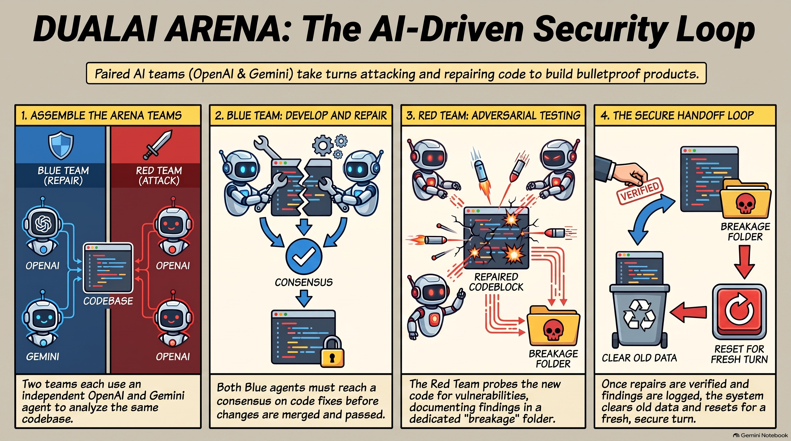

# DUAL-AI-ARENA

DUAL-AI-ARENA is a local-first Windows desktop security workbench for organizations that need repeatable AI-assisted software review, repair, and evidence capture.

## Enterprise overview

- **Dual review:** a Blue Team repair pass and an independent Red Team security pass examine the same project snapshot.
- **Provider choice:** configure OpenAI-compatible endpoints, Gemini, or a local Ollama deployment.
- **Desktop boundary:** the product is distributed as desktop software; it is not a hosted public scanning service.
- **Project scale:** projects are processed in sequential, context-aware batches. The 200-file batch window is not a project-size limit. Token estimates, byte size, file type, prompt overhead, reserved response space, and provider context limits determine additional splits.
- **Evidence:** review results and the next handoff are assembled from the completed batches rather than from a partial first pass.

## Security and data handling

- The local API binds to loopback.
- Provider configuration is stored locally in encrypted application settings.
- Source is sent only to the provider endpoints selected by the operator.
- Workspaces and review artifacts are encrypted at rest.
- No administrator backdoor, public API, or provider secret is bundled in the executable.
- Customers must use the product only with software and data they are authorized to inspect and must not submit secrets or production credentials to an AI provider.

These controls reduce exposure; they are not a security certification. Customers remain responsible for provider terms, retention settings, network controls, access management, and review of generated results.

## Enterprise readiness

The current product direction is a private desktop beta and developer evaluation release. Enterprise deployment should be coordinated before production use while signed packaging, update and licensing controls, centralized identity, policy management, and traceable release evidence are finalized.

The application source is maintained in a private repository. Source access, licensing, acquisition, implementation, and enterprise deployment inquiries can be directed to [thepros2014@gmail.com](mailto:thepros2014@gmail.com?subject=DUAL-AI-ARENA%20enterprise%20inquiry). The maintainer profile is available at [github.com/thepros2014](https://github.com/thepros2014).

## Security reporting

Do not publish API keys, credentials, private source, customer data, or an undisclosed vulnerability in Discussions. Report suspected security issues privately to [thepros2014@gmail.com](mailto:thepros2014@gmail.com?subject=DUAL-AI-ARENA%20security%20report).

## Supporting material

- [Security-loop concept brief](studio/AI_BATTLE_SECURITY_ARENA.pdf)
- [Maintainer profile](https://github.com/thepros2014)
